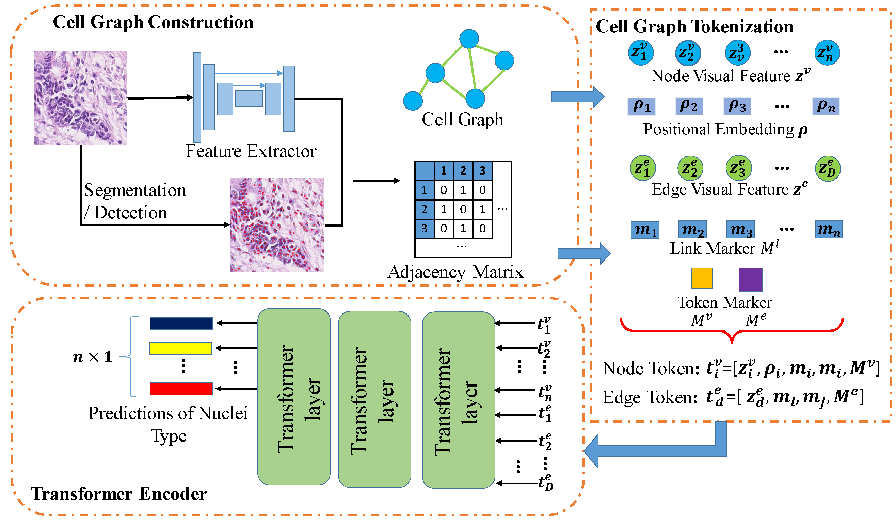

# Cell Graph Transformer for Nuclei Classification

This is the official PyTorch implementation of the paper - "Cell Graph Transformer for nuclei classification". 




## Set Up Environment
```
conda create --name CGT python=3.8
conda activate CGT
pip install -r requirements.txt
pip install torch==1.13.0+cu116 torchvision==0.14.0+cu116 torchaudio==0.13.0 --extra-index-url https://download.pytorch.org/whl/cu116
pip install torch-geometric torch-scatter torch-sparse
```
## Datasets
- [Lizard](https://openaccess.thecvf.com/content/ICCV2021W/CDPath/html/Graham_Lizard_A_Large-Scale_Dataset_for_Colonic_Nuclear_Instance_Segmentation_and_ICCVW_2021_paper.html)
- [PanNuke](https://arxiv.org/abs/2003.10778)
- [NuCLS](https://academic.oup.com/gigascience/article-abstract/doi/10.1093/gigascience/giac037/6586817)
- [BRCA-M2C](http://openaccess.thecvf.com/content/ICCV2021/html/Abousamra_Multi-Class_Cell_Detection_Using_Spatial_Context_Representation_ICCV_2021_paper.html)

# Running the Code

## Topology-aware pretraining
The GCN-based pretraining is mainly following the implementation of this work [SENUCLS](https://github.com/Lewislou/SENUCLS).
After the training of SENUCLS, we can have the GCN-pretrained weights. Some weights for the four datasets are in [BaiduNetdisk]().

## Training
If you use a dataset like BRCA-M2C that only contains point annotations for nuclei, please use the codes in CGT-POINT. For other datasets like Panuke and Lizard that have the polygon annotations for nuclei, please use the codes in CGT-POLYGON.

### Data Format
For training, patches must be extracted using `extract_patches.py`. For each patch, patches are stored as a 4-dimensional numpy array with channels [RGB, inst]. Here, inst is the instance segmentation ground truth. I.e. pixels range from 0 to N, where 0 is the background, and N is the number of nuclear instances for that particular image. 

Before training:

- Set path to the data directories in `config.py`
- Set path where checkpoints will be saved  in `config.py`
- Set path to pretrained weights in `models/CGT/opt.py`.
- Modify hyperparameters, including number of epochs and learning rate in `models/CGT/opt.py`.
- Set edge number, point number and class weights for Focal loss in `models/CGT/run_desc.py`.

- To initialize the training script with GPUs 0, the command is:
```
python run_train.py --gpu='0' 
```

## Inference

### Data Format

Input: <br />
- Standard image files, including `png`, `jpg` and `tiff`.
- Instance segmentation results output from other methods, like HoverNet or MaskRCNN. The formats of the segmentation results are '.mat'. The filename should match the testing images.

### Inference codes for tiles
```
python -u run_infer.py \
--gpu='0' \
--nr_types=6 \ # number of types + 1
--type_info_path=type_info.json \
--batch_size=1 \
--model_mode=original \
--model_path=.tar \ # choose the trained weights
--nr_inference_workers=1 \
--nr_post_proc_workers=16 \
tile \
--input_dir='PaNuKe/Fold3/images/' \ # testing tile path
--output_dir=panuke_out/ \  # output path
--inst_dir='inst_prediction/' \ # instance segmentation results path
--mem_usage=0.1 \
--save_qupath
```
Output: : <br />
- mat files / JSON files: Including centroid coordinates and nuclei types.
- overlay images: Visualization of the classification results.
## Citation

If any part of this code is used, please give appropriate citations to our paper. <br />

